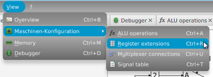
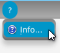

  

The _project_ menu holds the operations related to the project. As you can see there are quite a lot possibilities.
You can create a new project or open an old one. You can also save your current project under the same name as before or under a different name. You can undo and redo your changes. And it is also possible to export the [signal table](mmsim_tab_signaltable.html) or [schematics](mmsim_tab_overview.html) of the machine. And of course you can close the project or even exit the application.

&nbsp;

  

The _view_ menu gives you the opportunity to open the different tabs of the application, e.g. one you did not open yet.

&nbsp;

  

The _help_ menu contains an item to open the _about us_ window as well as the _language selection_. The available languages are English and German.