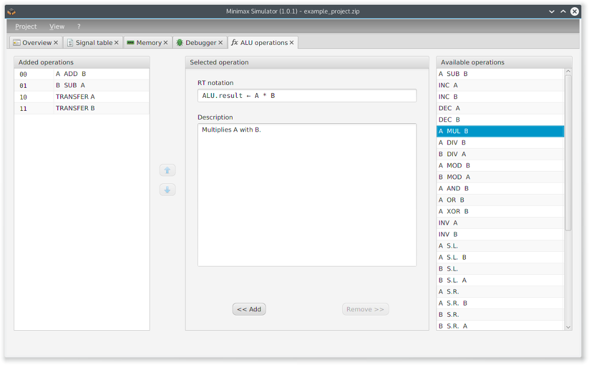

The tab _ALU operations_ is used for managing the ALU.

  

On the left side all ALU operations already implemented are listed. The arrow buttons can be used for moving the selected operation. A double click on an operation or one click followed by pressing  deletes the operation from the list of implemented operations.

On the right site all available and not yet implemented ALU operations are listed. Double clicking an operation or clicking it and pressing  afterwards adds the operation to the list of the implemented ones.

The area in the middle of the screen provides information about the recent selected operation.