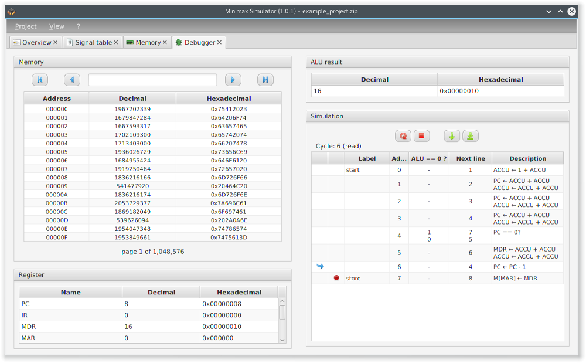
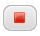

The tab _debugger_ is used for the simulation of the Minimax machine and the microcode.

  

Therefore the memory table is also placed here. Below this there is a list of registers showing the currently stored value of the register which is editable by double clicking it. The current result of the ALU is display too.
On the right side below the ALU result a simplified version of the signal table is shown. Only toggling the breakpoint setting is possible from within the debugger. Pressing  starts the simulation mode.

  <table>
    <tr>
      <td align="center">Button</td>
      <td>Action</td>
    </tr>
    <tr>
      <td align="center"></td>
      <td>
simulates one step of the machine
</td>
    </tr>
    <tr>
      <td align="center"></td>
      <td>
runs the microcode up to the next breakpoint or until the program finished
</td>  
    </tr>
    <tr>
      <td align="center"></td>
      <td>
resets the simulation to the starting state
</td>  
    </tr>
    <tr>
      <td align="center"></td>
      <td>
quits the simulation mode
</td>  
    </tr>
  </table>

