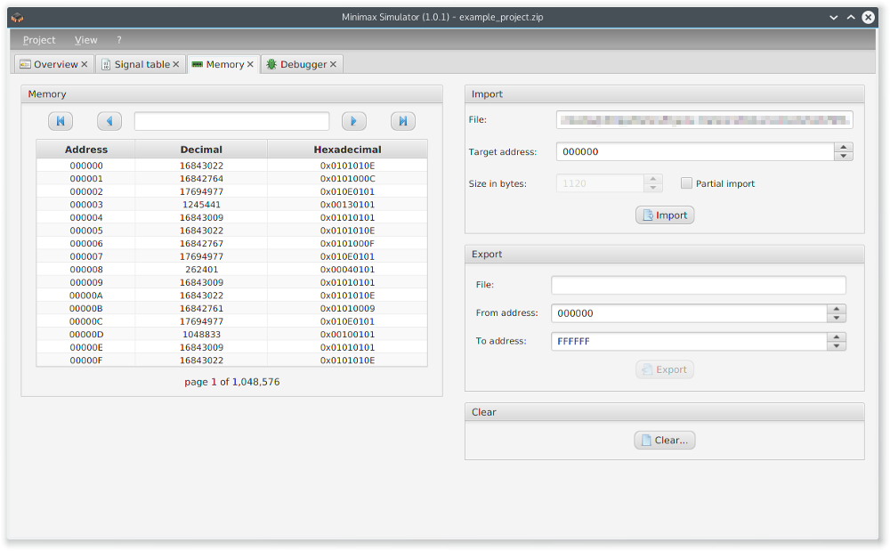
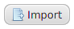
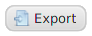
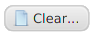

The tab _memory_ is used for memory management.

  

The buttons above the actual memory representation are used for navigating through the different pages of the memory. The text field allows jumping to a specific address in memory.

The value of each memory address can be edited by double clicking on the table row according to the wish memory address.

Memory images can be imported. It is possible to specify the address from which on the image should be imported to the machine memory, called _target address_. The _partial import_ setting allows importing only a part of the whole image. The default value is the file size of the selected memory image file. Pressing  performs the import.

For exporting a memory image it is also possible to limit the image by setting the first and last memory address to export. Clicking  saves the image to file.

For clearing the memory, e.g. after a change of the microcode, press  and the memory will be cleared.