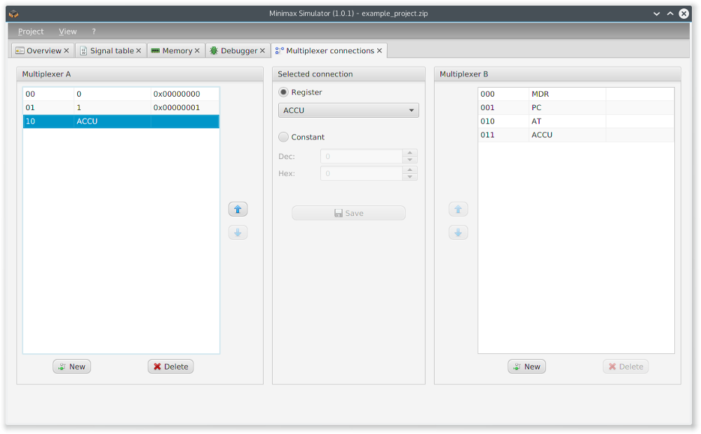
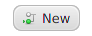

The tab _multiplexer connections_ is used for the management of the connections to the multiplexer A and B.

  

There are two different kinds of connections:

  <table>
    <tr>
      <td>register</td>
      <td>the data out of the register will be connected with the multiplexer</td>
    </tr>
    <tr>
      <td>constant</td>
      <td>the data in of the multiplexer will be wired with the value of the constant</td>
    </tr>
  </table> 

Pressing  adds a new connection to the multiplexer. Pressing  deletes the selected connection. Using the arrow buttons the selected connection can be moved up and down.