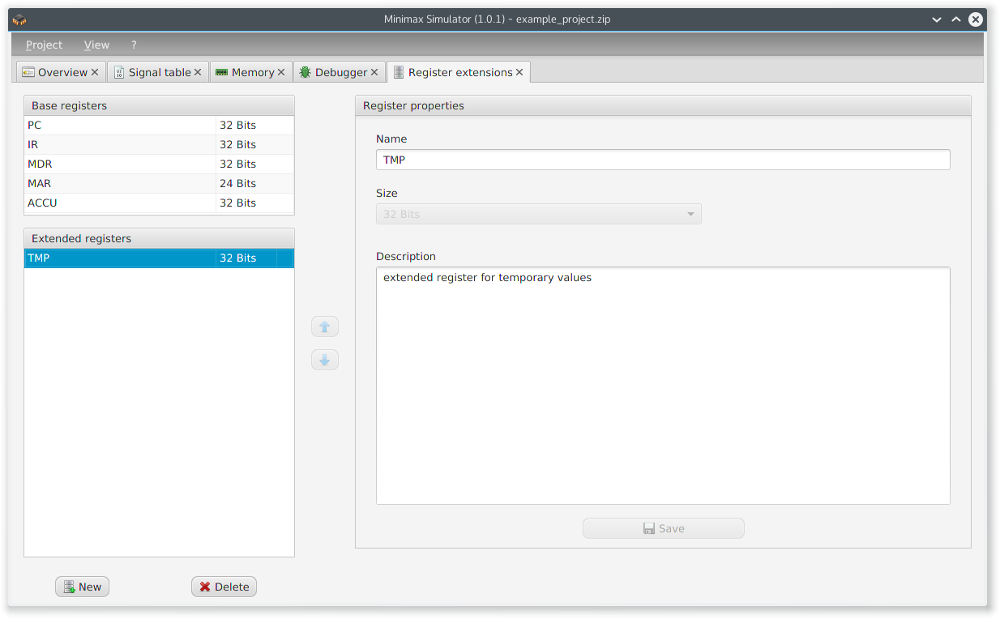
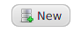
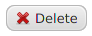

The tab _register extensions_ is used for managing the registers of the Minimax machine.

  

The base registers are displayed but they are not editable.

Pressing  adds a new register to the machine. The newly created register can be named and it is possible to add a description to it. The changes take effect after pressing . Deleting a register is done by selected the register from the list and then pressing .