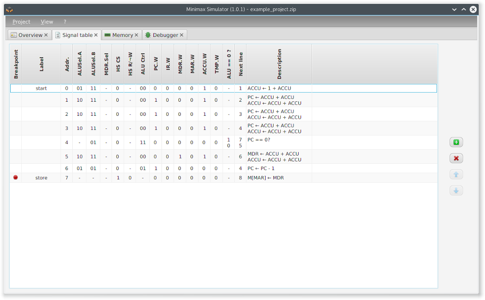
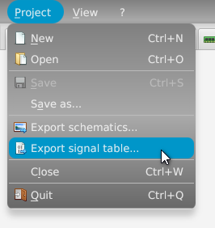

The tab _signal table_ shows the microcode of the Minimax machine.

  

You can toggle the breakpoint setting for each row by double clicking at the breakpoint column. The label, signals and jump targets can be edited the same way.

Pressing  adds a new signal row under the currently selected one or at the end of the table if no row is selected. The selected signal row can be deleted by clicking . Using <image class="inline" src="images/btn_up.png"> and  allows moving of the selected signal row.
   
The signal table can be exported as HTML and CSV.

